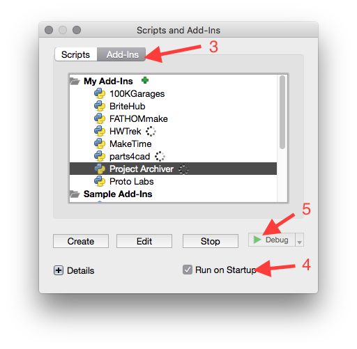

# Project-Archiver
The archiver script will open all Fusion 360 3D data in a project and export it as STEP to a local location of your choosing. 

[How to install](#How-to-install)  
[How to use](#How-to-use)

----

### How to install
#### Windows
Download the REPO.  

1. Click Clone or *Download*  
2. Click *Download Zip*  

3. Un-Zip to any convient location.
4. Copy the data to: %AppData%\Autodesk\Autodesk Fusion 360\API\AddIns

5. You should then see:

#### MAC OS
Download the REPO.  

1. Click Clone or **Download**  
2. Click **Download Zip**  

3. Un-Zip to any convient location.
4. Copy the data to: ~/Library/Application Support/Autodesk/Autodesk Fusion 360/API/AddIns

5. You should then see:

### Fusion 360  

1. Launch Fusion 360.
2. On the main toolbar click the **Scripts and Addins** button in the **Addins** Pane

	

3. Select the **Addins tab** and find the Archive-Exporter.  
4. Click **Run at startup**. 
5. Click run.  
 
	

6. Dismiss the Addins dialog.  
7.  On the main toolbar click the **Scripts and Addins** menu and you should see **Archive-Exporter** Pane.

	

----

## How to use

Launch Fusion 360.

In the **Scripts and Addins** dialog box select Add-ins and then "ProjectUtilities"

In the data panel navigate to the project you want to archive.

_The add-in will export all Fusion 360 files in the active project._

The commands will now be in the Add-ins drop down menu:

### Archive
The dialog shows you the **Project to Archive** which is the current active project.

It then allows you to enter a path. Type in a path into the **Output Path** field.
* For OSX this might be: **/Users/*username*/Desktop/Test/**
* For Windows this might be something like **C:\Test**

Finally under **Export Types** select the different files types you want to export.  You can select multiple types.

Click **OK**.

Fusion will open and export each 3D design. Depending on the size of design and bandwidth this can take some time. Fuison 360 will be busy for the duration of the script running, so it would be advisable to run this on a dedicated machine that you can leav to run for some time. 

### Statistics
Select the Statistics command from the addins drop down.

It then allows you to enter a path. Type in a path into the **Output Path** field.

* For OSX this might be: **/Users/*username*/Desktop/Test/**
* For Windows this might be something like **C:\Test**

The default will be into: HOME/ProjectUtilities/**Project_Name**

_files.csv_ : Contains information about all files in the project

_folders.csv_ : Contains information about all the folders in the project

